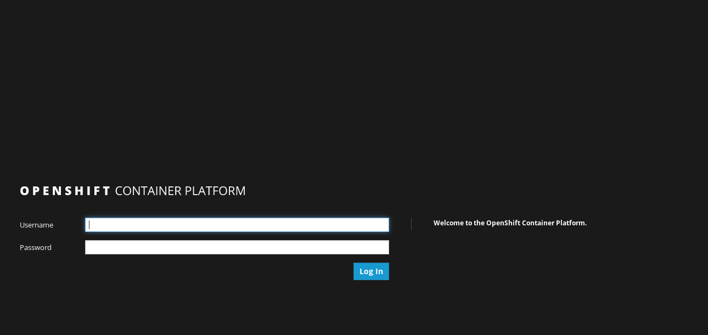
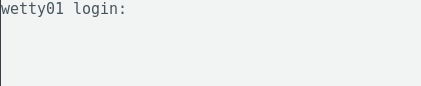
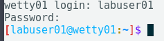

# Openshiftv3 Workshop on Azure


`Openshiftv3 Workshop` is a ansible playbook to provision Openshift in Azure. This playbook uses Ansible to deploy Azure templates, for provisioning Azure infrastructure and nodes. To find more info about the templates [check here](https://github.com/Microsoft/openshift-container-platform)

These modules all require that you have Azure ID's available to use to provision Azure resources. You also need to have Azure permissions set to allow you to create resources within Azure. There are several methods for setting up you Azure environment on you local machine.

This repo also requires that you have Ansible installed on your local machine. For the most upto date methods of installing Ansible for your operating system [check here](http://docs.ansible.com/ansible/intro_installation.html).

## Prerequisites

### Generate SSH Keys

You'll need to generate an SSH key pair (Public / Private) in order to provision this template. Ensure that you do **NOT** include a passphrase with the private key. <br/><br/>
If you are using a Windows computer, you can download puttygen.exe.  You will need to export to OpenSSH (from Conversions menu) to get a valid Private Key for use in the Template.<br/><br/>
From a Linux or Mac, you can just use the ssh-keygen command.  Once you are finished deploying the cluster, you can always generate new keys that uses a passphrase and replace the original ones used during initial deployment.

### Create Key Vault to store SSH Private Key

You will need to create a Key Vault to store your SSH Private Key that will then be used as part of the deployment.  This extra work is to provide security around the Private Key - especially since it does not have a passphrase.  I recommend creating a Resource Group specifically to store the KeyVault.  This way, you can reuse the KeyVault for other deployments and you won't have to create this every time you chose to deploy another OpenShift cluster.

**Create Key Vault using Azure CLI 2.0**<br/>
1.  Create new Resource Group: az group create -n \<name\> -l \<location\><br/>
    Ex: `az group create -n ResourceGroupName -l 'East US'`<br/>
1.  Create Key Vault: az keyvault create -n \<vault-name\> -g \<resource-group\> -l \<location\> --enabled-for-template-deployment true<br/>
    Ex: `az keyvault create -n KeyVaultName -g ResourceGroupName -l 'East US' --enabled-for-template-deployment true`<br/>
1.  Create Secret: az keyvault secret set --vault-name \<vault-name\> -n \<secret-name\> --file \<private-key-file-name\><br/>
    Ex: `az keyvault secret set --vault-name KeyVaultName -n SecretName --file ~/.ssh/id_rsa`<br/>

### Generate Azure Active Directory (AAD) Service Principal

To configure Azure as the Cloud Provider for OpenShift Container Platform, you will need to create an Azure Active Directory Service Principal.  The easiest way to perform this task is via the Azure CLI.  Below are the steps for doing this.

Assigning permissions to the entire Subscription is the easiest method but does give the Service Principal permissions to all resources in the Subscription.  Assigning permissions to only the Resource Group is the most secure as the Service Principal is restricted to only that one Resource Group.

**Azure CLI 2.0**

1. **Create Service Principal and assign permissions to Subscription**<br/>
  a.  az ad sp create-for-rbac -n \<friendly name\> --password \<password\> --role contributor --scopes /subscriptions/\<subscription_id\><br/>
      Ex: `az ad sp create-for-rbac -n openshiftcloudprovider --password Pass@word1 --role contributor --scopes /subscriptions/555a123b-1234-5ccc-defgh-6789abcdef01`<br/>

2. **Create Service Principal and assign permissions to Resource Group**<br/>
  a.  If you use this option, you must have created the Resource Group first.  Be sure you don't create any resources in this Resource Group before deploying the cluster.<br/>
  b.  az ad sp create-for-rbac -n \<friendly name\> --password \<password\> --role contributor --scopes /subscriptions/\<subscription_id\>/resourceGroups/\<Resource Group Name\><br/>
      Ex: `az ad sp create-for-rbac -n openshiftcloudprovider --password Pass@word1 --role contributor --scopes /subscriptions/555a123b-1234-5ccc-defgh-6789abcdef01/resourceGroups/00000test`<br/>

3. **Create Service Principal without assigning permissions to Resource Group**<br/>
  a.  If you use this option, you will need to assign permissions to either the Subscription or the newly created Resource Group shortly after you initiate the deployment of the cluster or the post installation scripts will fail when configuring Azure as the Cloud Provider.<br/>
  b.  az ad sp create-for-rbac -n \<friendly name\> --password \<password\> --role contributor --skip-assignment<br/>
      Ex: `az ad sp create-for-rbac -n openshiftcloudprovider --password Pass@word1 --role contributor --skip-assignment`<br/>

You will get an output similar to:

```javascript
{
  "appId": "2c8c6a58-44ac-452e-95d8-a790f6ade583",
  "displayName": "openshiftcloudprovider",
  "name": "http://openshiftcloudprovider",
  "password": "Pass@word1",
  "tenant": "12a345bc-1234-dddd-12ab-34cdef56ab78"
}
```

The appId is used for the aadClientId parameter.

## Azure Infrastructure Roles


### roles/azure.infra

To create infrastructure and a Openshift instance via Ansible:

First, copy group_vars/all_example to group_vars/all, and then edit `group_vars/all` and fill out the below variables:


```
#####################################################
Azure Information
#####################################################
azure_subscription_id:            ""
azure_client_id:                  ""
azure_client_secret:		          ""
azure_tenant_id:		              ""
azure_image_id:                   ""
ssh_public_key:                   "" # Full public key
key_vault_resource_group:         "" # Resource group where key vault is located
key_vault_name:                   "" # Name of the key vault
key_vault_secret:                 "" # Name of the secret key
#####################################################
Red Hat Information
#####################################################
username:                         ""
password:                         ""
pool_id:                          ""
```

## Configure Workshop Nodes
To call Ansible to provision the nodes and openshift environment run the first playbook.

```
ansible-playbook 1_provision.yml

```
Once the first playbook is created, go back into group_vars/all and update the bastion_fqdn with found in the Azure portal -> bastion VM -> DNS name. Then run the second playbook.

```
ansible-playbook 2_loadinformation.yml

```

To install and configure all of the needed software for the workshop run the below command replacing the openshift_admin_username and private key location with your own.

```
ansible-playbook -u {{ openshift_admin_username }} 3_setup_bastion_host.yml --private-key {{ /etc/ssh/openshift_ssh_rsa }}

```

## Login to Ansible Tower

Browse to the URL of the Master DNS load balancer. This can be found in the Azure portal -> master VM -> DNS name.

```
https://{{ master_fqdn }}/console

```
username: found in `group_vars/all` variable `openshift_admin_username`

password: found in `group_vars/all` variable `openshift_password`



There is a web based ide (wetty) running on the bastion node that each user can log into. This will give them access to perform the Openshift commands on the workshop

```
https://{{ bastion_fqdn }}/wetty

```



The login for the wetty access will be `labuser(01-50)` with a password of `RedHat123`.




## Walkthrough for Scripts

A walkthrough for most of the typewritten steps has been added to the workshop, both to speed up workshops presented within a limited schedule, or to help a studenmt who has made a mistake, or who has fallen far behind.

The walkthrough is deployed on the tower nodes, in `~azure-user/walkthrough`.
