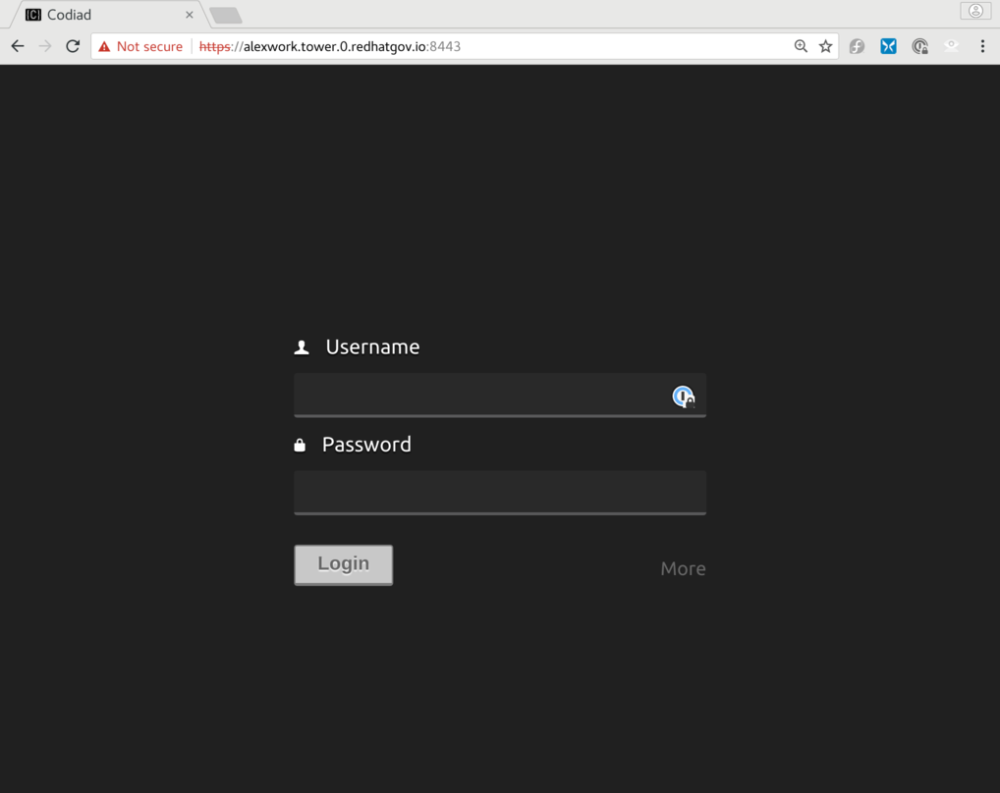

# Openshiftv3 Workshop on Azure


`Openshiftv3 Workshop` is a ansible playbook to provision Openshift in Azure. This playbook uses Ansible to deploy Azure templates, for provisioning Azure infrastructure and nodes. To find more info about the templates [check here](https://github.com/Microsoft/openshift-container-platform)

These modules all require that you have Azure ID's available to use to provision Azure resources. You also need to have Azure permissions set to allow you to create resources within Azure. There are several methods for setting up you Azure environment on you local machine.

<!-- Fill out `env.sh` & Export the Azure ID's

First, copy env.sh_example to env.sh, and then fill in your ID's.  Once that is complete, source the script, to export your Azure environment variables.

```
source env.sh
``` -->

This repo also requires that you have Ansible installed on your local machine. For the most upto date methods of installing Ansible for your operating system [check here](http://docs.ansible.com/ansible/intro_installation.html).

## Azure Infrastructure Roles


### roles/azure.infra

To create infrastructure and a Openshift instance via Ansible:

First, copy group_vars/all_example to group_vars/all, and then edit `group_vars/all` and fill out the below variables:


```
#####################################################
Azure Information
#####################################################
azure_subscription_id:            ""
azure_client_id:                  ""
azure_client_secret:		          ""
azure_tenant_id:		              ""
azure_image_id:                   ""
ssh_public_key:                   "" # Full public key
key_vault_resource_group:         "" # Resource group where key vault is located
key_vault_name:                   "" # Name of the key vault
key_vault_secret:                 "" # Name of the secret key
#####################################################
Red Hat Information
#####################################################
username:                         ""
password:                         ""
pool_id:                          ""
```

## Configure Workshop Nodes
To call Ansible to provision the nodes and openshift environment run the first playbook.

```
ansible-playbook 1_provision.yml

```
Once the first playbook is created, go back into group_vars/all and update the bastion_fqdn with found in the Azure portal -> bastion VM -> DNS name. Then run the second playbook.

```
ansible-playbook 2_loadinformation.yml

```

To install and configure all of the needed software for the workshop run the below command replacing the openshift_admin_username and private key location with your own.

```
ansible-playbook -u {{ openshift_admin_username }} 3_setup_bastion_host.yml --private-key {{ /etc/ssh/openshift_ssh_rsa }}

```

## Login to Ansible Tower

Browse to the URL of the Master DNS load balancer. This can be found in the Azure portal -> master VM -> DNS name.

```
https://{{ master_fqdn }}/console

```
username: found in `group_vars/all` variable `openshift_admin_username`

password: found in `group_vars/all` variable `openshift_password`


There is a web-based IDE running on port 8443 of each tower node.  That IDE can be used to edit Ansible playbooks, rather than using a command line editor, like `vim` or `nano`.

```
https://{{ workshop_prefix }}-tower0.{{ region }}.cloudapp.azure.com:8443
```



## Walkthrough for Scripts

A walkthrough for most of the typewritten steps has been added to the workshop, both to speed up workshops presented within a limited schedule, or to help a studenmt who has made a mistake, or who has fallen far behind.

The walkthrough is deployed on the tower nodes, in `~azure-user/walkthrough`.
